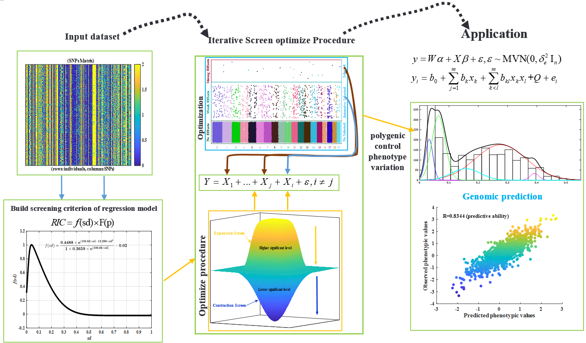
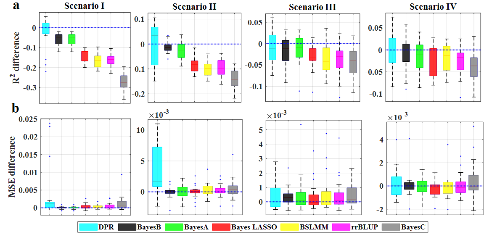
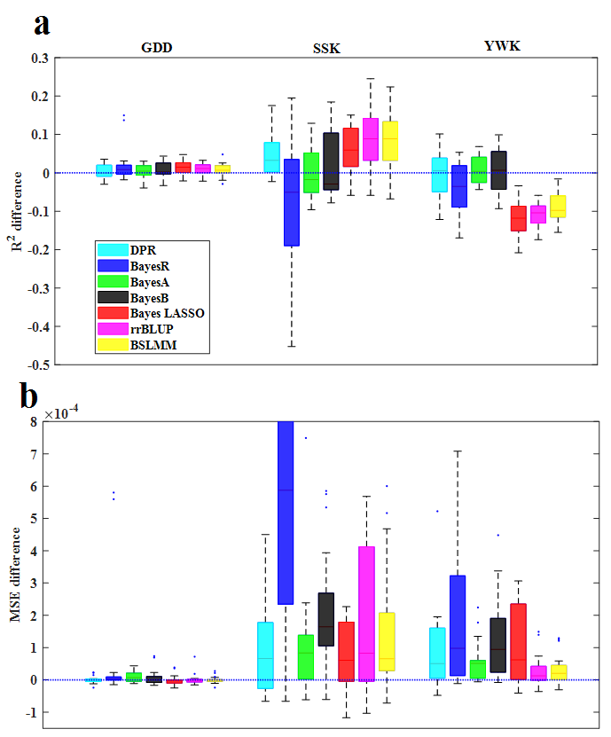

### Polygenic Prediction of Complex Traits with Iterative Screen Regression Models


<div align="center"><a href=""></a></div>

#### Compared result For Polygenic Prediction model 

</p>
<p align="center">
<a href="/Fig/PVE5.png">

</a>
</p>


> <span style="font-family: Times New Roman; font-size:1em;"><font size="4"> <div align="justify"> Schematic overview of model-based is iterative screening regression for GS. The first input dataset with markers (SNPs) matrix representing individual genotypes (rows) of a population with alleles (0, 2, and 1, missing genotypes will be replaced by the mean genotype or imputed by others complicate algorithm) per marker (columns). Secondly, we formulated a regression information criterion (RIC, objective function) as the screening criterion of the regression model. Combined the proposed iterative screen optimize the procedure, which mainly included expansion screen and contraction select two-steps. The third, apply it to multiple regression analysis, and two models can be selected, one for the linear model and the other for is the binomial model (including the epistasis effect). We using ISR model for  Polygenic prediction, comparing with [DPR](http://xzlab.org/software.html), [BayesR](https://github.com/syntheke/bayesR), [BSLMM](http://xzlab.org/software.html),[rrBLUP](https://cran.r-project.org/web/packages/rrBLUP/index.html),[Bayes A,B,C AND LASSO](https://github.com/gdlc/BGLR-R).
</div></font> </span>

# Installation
>Only to need install [MATLAB](https://www.mathworks.com/products/matlab.html) software which the code can compile in linux and window environment.
# Data Preparation
## Missing genotypes 
> <span style="font-family: Times New Roman; font-size:1em;"><font size="4"> <div align="justify">The ISR method relies on having complete or imputed genotype data at each SNP. That is, ISR requires the user to impute all missing genotypes before perform association testing. This imputation step is arguably preferable than simply dropping individuals with missing genotypes since it can improve power to detect associations. Therefore, for fitting ISR that missing genotypes are recommended to be imputed first (e.g.,using the [Beagle](https://faculty.washington.edu/browning/beagle/beagle.html)). Otherwise, the missing genotypes for SNPs which replaced with the estimated mean or median genotype of that SNP in ISR.</div></font> </span>


## Missing Phenotypes
><span style="font-family: Times New Roman; font-size:1em;"><font size="4"> <div align="justify">Individuals with missing phenotypes will not be included in the ISR analysis. If all individuals have missing phenotypes, then no SNP and no individuals will be included in the analysis.</div></font> </span>


## Input File Formats
><span style="font-family: Times New Roman; font-size:1em;"><font size="4"> <div align="justify"> ISR requires four input files containing genotypes, phenotypes,and covariates (optionally). Genotype and phenotype files can be in multiple formats, which the PLINK binary [traw (recommended)](https://www.cog-genomics.org/plink/1.9/formats#traw), [bed](https://www.cog-genomics.org/plink/1.9/formats#bed),  and [vcf](https://samtools.github.io/hts-specs/VCFv4.2.pdf) formats. which bed and vcf formats only can run in linux, and using [PLINK](https://www.cog-genomics.org/plink/2.0/) software recode to .traw format that codes genotypes using 0/1/2.</div></font> </span>

```matlab
# or can use the R.matlab R packages output the mat format 
> traw2mat('pop.fam','pop.traw','pop.mat',2279,355551,1,1)
```

### Phenotype File
><span style="font-family: Times New Roman; font-size:1em;"><font size="4"> <div align="justify"> Reformat the phenotype files in the same order of [.fam](https://www.cog-genomics.org/plink/1.9/formats#fam) (PLINK sample information file). The columns represented as following, included the six columns and both the phenotype value. Missing phenotype information is denoted as NA. The number of rows should be equal to the number of individuals in the genotype file. </div></font> </span>

<span style="font-family: Times New Roman; font-size:1em;"><font size="4"> <div align="justify">
1. Family ID ('FID')
2. Within-family ID ('IID'; cannot be '0')
3. Within-family ID of father ('0' if father isn't in dataset)
4. Within-family ID of mother ('0' if mother isn't in dataset)
5. Sex code ('1' = male, '2' = female, '0' = unknown)
6. Phenotype value ('1' = control, '2' = case, '-9'/'0'/non-numeric = missing data if case/control) >- trait one 
7. trait two
8. ....
....
</div></font> </span>

# Running ISR 
> Compile in linux enviroment. make sure you add alias in path like  "alias matlab='/mnt/d/linux/MATLAB2016b/bin/matlab -nodesktop -nosplash -singleCompThread -logfile `date +%Y_%m_%d-%H_%M_%S`.log -r'" before Running. A Small GWAS Example Dataset Running as following:
```matlab
%% not add covariates 
$ matlab "PPISR_linux('phefile','../data/pop.fam','genofile','../data/pop.traw','sample',87,'nSNP',28228,'ntrait',1,'ncov',5),exit;"
%% add five PCs as covariates
$ matlab "PPISR_linux('phefile','../data/pop.fam','genofile','../data/pop.traw','sample',87,'nSNP',28228,'ntrait',1,'ncov',5),exit;"
%% nolinear model and epistasis 
$ matlab "PPISR_linux('phefile','../data/pop.fam','genofile','../data/pop.traw','sample',87,'nSNP',28228,'ntrait',1,'ncov',5,'mdl',2),exit;"
%% load mat data
$ matlab "PPISR_linux('matfile','demo.mat','sample',798,'nSNP',92641,'ncov',3),exit;"
$ Basic Usage
Options :
phefile = string, can be any of file format split with "\t"(default = 'phe.fam')
genofile = string, .traw file format from plink (default = 'pop.traw')
outfile = string, save covert genotypes file name with any name you defined and save matlab format (default = 'pop.traw.mat')
sample = number, the number of individuals you want to analysis
nSNP = number, the number of SNPs.
ntrait = number, the number of traits.
chr = number, the number of chromosome.
opt_outresult = string, write the result to text file (default = 'ISR.opt.outresult.txt') 
all_outresult = string, write the result to text file (default = 'ISR.outresult.txt')  
vcf = string, the VCF file name.
bed = string, the bed file name.
ncov = number, the number of PCs covariates.
IM = impute missing genotype with mean and median value, '1' was the default method means and others was median.
sgv = number, the bonferroni correction for association tests results.
mdl = number, 1 for linear model and 2 or 3 for nolinear model ; input('Using Model II(without square term 2) or Model III(with square term 3) 2/3? ').
```

## Output Files
> <span style="font-family: Times New Roman; font-size:1em;"><font size="4"> <div align="justify"> There will be two output files, both inside an output folder in the current directory. The pre-fix.log.txt file contains some detailed information about the running parameters and computation time. In addition, prefix.log.txt contains PVE estimate and its standard error in the null linear mixed model. </div></font> </span>

> <span style="font-family: Times New Roman; font-size:1em;"><font size="4"> <div align="justify"> The ISR.outresult.txt contains the results. An example file with a few SNPs is shown below: </div></font> </span>

<span style="font-family: Times New Roman; font-size:1em;"><font size="4"> <div align="justify">
1. SNP	Chromosome	Position	Ft	P_F	Beta	SEbeta	R2
2. chr1_3913855	1	3913855	0.046 	8.3E-01	0.0111 	0.0517 	0.0001 
3. chr1_3913895	1	3913895	1.737 	1.9E-01	0.1237 	0.0939 	0.0034 
4. chr1_4680660	1	4680660	0.161 	6.9E-01	-0.0324 	0.0807 	0.0003 
5. chr1_4680664	1	4680664	0.572 	4.5E-01	-0.0841 	0.1113 	0.0011 
6. chr1_4680724	1	4680724	0.807 	3.7E-01	-0.0697 	0.0776 	0.0016 
7. chr1_4680752	1	4680752	1.333 	2.5E-01	-0.1330 	0.1151 	0.0026 
8. chr1_4680899	1	4680899	3.587 	6.2E-02	-0.1385 	0.0731 	0.0069 
</div></font> </span>

> <span style="font-family: Times New Roman; font-size:1em;"><font size="4"> <div align="justify"> The eight columns are: SNP ids, chromosome, base-pair positions on the chromosome, F value and p-value for F value, beta estimates, standard errors for beta, estimates each marker PVE. And ISR.opt.outresult.txt  only contain the significant marker after Bonferroni correction at 5% default.</div></font> </span>

## Maize dataset result

</p>
<p align="center">
<a href="/Fig/maize.png">

</a>
</p>

## Citation
Meng Luo and Shiliang Gu (2020). [Polygenic Prediction of Complex Traits with Iterative Screen Regression Models](https://www.biorxiv.org/content/10.1101/2020.11.29.402180v1). bioRxiv.

## Contact

If you are interested in our model, and found any questions OR comments feel free to contact [me](czheluo@gmail.com).
